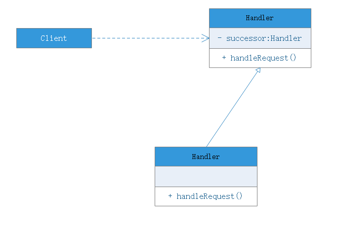

# 职责链模式

## 模式概述
很多情况下，在一个软件系统中可以处理请求的对象不止一个，例如SCM系统中采购单审批，主任、副董事、董事、董事会都可以处理采购单，它们可以**构成一条处理采购单审批的链式结构**，采购单沿着这条链进行传递，这条链就被称为职责链。职责链可以是一条直线、一个环或者一个树形结构，最常见的是一条直线，即沿着一条单向的链式结构来传递请求。链上的每一个对象都是请求处理者，职责链模式可以将请求的处理者组织成一条链，并让请求沿着链传递，由链上的处理者对请求进行相应的处理，客户端无须关心处理细节以及请求的传递，只需将请求发送到链上即可，实现请求发送者和请求处理者解耦。

## 模式定义
避免请求发送者与请求接收者耦合在一起，让多个对象都有可能接收请求，将这些对象连接成一条链，并且沿着这条链传递请求，直到有对象处理它为止。职责链模式是对象行为型模式。

## 模式结构
包含角色：
- Handler（处理者）
    - 定义了一个处理请求的接口，一般设计为抽象类，由于不同的具体处理者处理请求的方式不同，因此在其中定义了抽象请求处理方法。因为每一个处理者的下家还是一个处理者，因此在抽象处理者中定义了一个抽象处理者类型对象，作为其对下家的引用，通过该引用，处理者可以连成一条链
- ConcreteHandler（具体处理者）
    - 抽象处理者的子类，可以处理用户请求，在具体处理者类中实现了抽象处理者的请求处理方法，在处理请求之前要进行判断，看是否有相应的处理权限，如果可以处理请求就处理它，否则将继续转发给后继者；在具体处理者中可以访问链中下一个对象，以便请求的转发

在职责链模式里，很多对象由每一个对象对其下家的引用而连接起来形成一条链，请求在这条链上进行传递，知道链上一个对象处理这个请求为止。发出请求的客户端并不知道链上哪一个对象最终处理这个请求，这使得系统可以在不影响客户类代码的情况下动态的重新组织链和分配职责。

需要注意：

职责链模式并不创建职责链，职责链的创建工作必须由系统的其他部分完成，一般是在使用该职责链的客户端中创建。

## 模式扩展
- 纯职责链模式
    - 一个纯的职责链模式要求一个具体处理者对象只能在两个行为中选择一个：要么承担全部责任，要么将责任推给下家，不允许出现一个具体处理者在处理了一部分后将责任传递给下家。
    - 要求一个请求必须被某一个处理者对象所接收，不能出现请求未被任何一个处理者对象处理的情况
- 不纯职责链模式
    - 在一个不纯的职责链模式中允许某个请求被一个具体处理者处理部分后再向下传递，或者一个具体处理者处理完某请求后其后继处理者可以继续处理请求，**而且一个请求可以最终不被任何处理者对象所接收**
    - 又叫事件浮升处理方式

## 总结
职责链模式通过建立一条链来组织请求的处理者，请求将沿着链进行传递，请求发送者无须知道何时、何出请求被处理，实现了请求发送与请求处理的解耦。在软件开发中，如果遇到有多个对象可以处理同一请求时可以应用职责链，例如在Web应用开发中创建要给过滤器链来对请求进行处理，在工作流系统中实现公分的分级审批，使用职责链模式可以很好地解决此类问题。

### 优点
- 职责链模式使得一个对象无须知道是其他哪一个对象处理其请求，对象仅需知道该请求会被处理即可，接收者和发送者都没有对方地明确信息，且链中地对象不需要知道链地结构，由客户端负责链的创建，降低了系统的耦合度
- 请求处理对象仅需维持一个指向后继处理对象的引用，而不需要维护所有候选处理者的引用，可简化对象的互相连接
- 在给对象分配职责时，职责链可以给我们更多的灵活性，可以通过在运行时对该链动态的增加或修改来增加或改变处理一个请求的职责
- 在系统中增加一个新的具体处理者，无须修改原有系统代码，只需在客户端重新建链即可，符合开闭原则

### 缺点
- 一个请求由于没有明确的接收者，那么该请求的处理得不到保障，可能到链的末端都未处理
- 对于比较长的链，请求的处理可能涉及多个对象，系统性能可能受到影响，而且在运行时比较难以调试
- 如果建链不当，可能产生循环链，导致系统陷入死循环

### 适用场景
- 有多个对象可以处理同一个请求，具体哪个对象处理该请求待运行时确定，客户端只需要将请求提交到链上即可，而无需关心请求的处理对象是谁以及它如何处理的
- 在不明确指定接收者的情况下，向多个对象中的一个提交请求
- 可动态指定一组对象处理请求，客户端可动态创建职责链来处理请求，还可以改变中间处理者之间的先后次序

