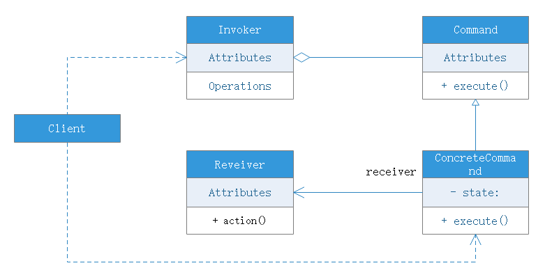
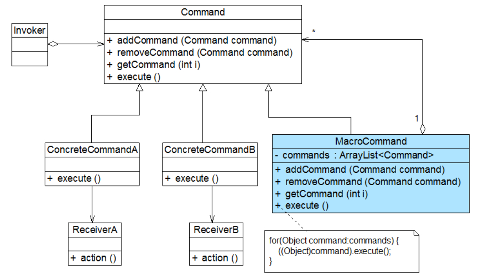

# 命令模式

## 模式背景
装修新房的最后几道工序之一是安装插座和开关，通过开关可以控制一些电器的打开和关闭，例如电灯或者排气扇。在购买开关时，我们并不知道它用来控制什么电器，也就是说，开关与电灯、排气扇并无直接关系，一个开关在安装之后可以用来控制电灯，也可以用来控制排气扇或其他电器。开关与电器通过电线相连，如果开关打开，则电线通电；反之。相同的开关可以通过不同的电线控制不同的电器。

我们可以将开关理解为请求的发送者，用户通过它来发送一个“开灯”请求，而电灯是“开灯”请求的最终接收者和处理者。

在软件开发系统中页存在很多与开关和电器类似的请求发送者和接收对象，例如一个按钮，它可能是一个“关闭窗口”请求的发送者，而按钮点击事件处理类则是该请求的接收者。为了降低系统的耦合度，将请求的发送者和接收者解耦，我们可以使用一种被称为命令模式的设计模式来设计系统，**在命令模式中，发送者与接收者之间引入了新的命令对象（类似电线？？？），将发送者的请求封装在命令对象中，再通过命令对象调用接收者的方法。**

## 模式概述
在软件开发中，我们经常需要向某些对象发送请求（调用其中的某个或某些方法），但是并不知道请求的接收者是谁，也不知道被操作的是哪个，此时我们特别希望能够以一种松耦合的方式来设计软件，使得请求发送者和请求接收者能够消除彼此之间的耦合，让对象之间的调用关系更为灵活，可以灵活地指定请求发送者以及被请求的操作，命令模式为此类问题提供了一个较为完美的解决方案：

**命令模式可以将请求发送者和请求接收者完全解耦，发送者和接收者之间没有直接引用关系，发送请求的对象只需要知道如何发送请求，而不需要知道如何完成请求。**

## 模式定义
将一个请求封装为一个对象，从而让我们可用不同的请求对客户进行参数化；对请求排队或者记录请求日志，以及支持可撤销的操作。命令模式是一种对象行为模式，其别名为动作模式或事务模式。

## 模式结构
命令模式包含如下角色：
- Command（抽象命令类）
    - 一般是一个抽象类或接口，在其中声明了用于执行请求的execute()等方法，通过这些方法可以调用请求接收者的相关操作
- ConcreteCommand（具体命令类）
    - 具体命令类是抽象命令类的子类，实现了在抽象命令类中声明的方法，它对应具体的接收者对象，将接收者的动作绑定在其中；实现execute()方法时，将调用接收者对象的相关操作
- Invoker（调用者）
    - 调用者即请求发送者，它通过命令对象来执行请求。一个调用者并不需要在设计时确定接收者，因此它只与抽象命令类之间存在关联关系。在程序运行时可以将一个具体命令对象注入其中，再调用具体命令对象的execute()方法，从而实现间接调用请求接收者的相关操作
- Receiver（请求接收者）
    - 接收者执行与请求相关的操作，它具体实现对请求的业务处理

## 模式分析
命令模式的本质是对请求进行封装，一个请求对应一个命令，将发出命令的责任和执行命令的责任分离。每一个命令都是一个操作：请求的一方发出请求要求执行一个操作；接收的一方收到请求，并执行相应的操作。**命令模式允许请求的一方和接收的一方独立开来，使得请求的一方不必知道接收请求的一方的接口，更不必知道请求如何被接收、操作是否被执行、何时被执行，以及怎么执行的。**

命令模式的关键在于引入抽象命令类，请求发送者针对抽象命令类进行编程，只有实现了抽象命令类的具体命令才与请求接收者相关联。

在最简单的抽象命令类中只包含了一个抽象的execute()方法，每个具体命令类将一个Receiver类型的对象作为一个实例变量进行存储，从而具体指定一个请求的接收者，不同的具体命令类提供了execute()方法的不同实现，并调用不同接收者的请求处理方法。

## 拓展
- 命令队列
- 日志处理
- 宏命令（组合命令）
    - 宏命令又称组合命令，它是组合模式和命令模式联用的产物。宏命令是一个具体命令类，它拥有一个集合属性，在该集合中包含了对其他命令对象的引用。通常宏命令不直接与请求接收者交互，而是通过它的成员来调用接收者的方法。当调用宏命令的execute()方法时，将递归调用它所包含的每个成员命令的execute()方法，一个宏命令的成员可以是简单命令还可以继续是宏命令。执行一个宏命令将触发多个具体命令的执行，从而实现对命令的批处理

## 优点
- 降低系统耦合度
- 新的命令可以很容易地加入到系统中
- 可以比较容易地设计一个命令队列或宏命令
- 为请求的撤销和恢复操作了一种设计和实现的方案

## 缺点
- 使用命令模式可能会导致某些系统有过多的命令类。因为针对每一个对请求接收者的调用操作都需要设计一个具体命令类，因此在某些系统中可能需要提供大量的命令类，这将影响模式的使用

## 适用场景
- 系统需要将请求调用者和请求接收者解耦,使得调用者和接收者不直接交互。请求调用者无须知道接收者的存在，也无须知道接收者是谁，接收者无须关心何时被调用
- 系统需要在不同的时间指定请求、将请求排队和执行请求。一个命令对象和请求的初始调用者可以有不同的生命期，换言之，最初的请求发出者可能已经不在了，而命令对象依然存活，可以通过该命令对象去调用请求接收者，而无须关心请求调用者的存在性，可以通过请求日志文件等机制来具体实现
- 系统需要支持命令的撤销和恢复操作
- 系统需要将一组操作组合在一起形成宏命令