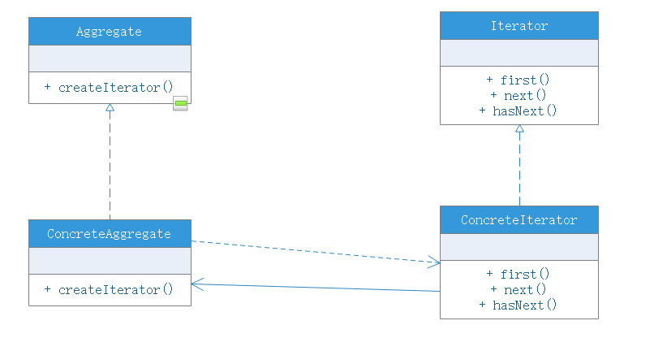

# 迭代器模式

## 模式概述
在软件开发中，我们经常需要使用聚合对象来存储一系列数据。聚合对象拥有两个职责：一是存储数据；二是遍历数据。从依赖性来看，前者是聚合对象的基本职责；而后者是可变化的，也是可分离的。因此，可以将遍历数据的行为从聚合对象中分离开来，封装在一个被称之为“迭代器”的对象中，由迭代器来提供遍历聚合对象内部数据的行为，这将简化聚合对象的设计，更符合单一职责原则。

## 模式定义
迭代器模式（iterator）：提供一种方法来访问聚合对象，而不用暴露这个对象的内部表示，其别名游标（cursor），迭代器模式是一种对象行为型模式

## 模式结构
在迭代器模式结构中包含了聚合和迭代器两个层次，考虑到系统的灵活性和可扩展性，在迭代器模式中应用了工厂方法模式：
- Iterator（抽象迭代器）：定义了访问和遍历元素的接口，声明了用于遍历数据元素的方法，例如：用于获取第一个元素的first()方法，用于访问下一个元素的next()方法，用于判断是否还有下一个元素的hasNext()方法，用于获取当前元素的currentItem()方法等，在具体迭代器中实现这些方法
- ConcreteIterator（具体迭代器）：实现了抽象迭代器接口，完成对聚合对象的遍历，同时在具体迭代器中通过游标来记录在聚合对象中所处的当前位置，在具体实现中，游标通常是一个表示位置的非负整数
- Aggregate（抽象聚合类）：用于存储和管理元素对象，声明一个createIterator()方法用于创建一个迭代器对象，充当抽象迭代器工厂角色
- ConcreteAggregate（具体聚合类）：它实现了在抽象聚合类中声明的createIterator（）方法，该方法返回一个与该具体聚合类对应的具体迭代器ConcreteIterator实例

在迭代器模式中，提供了一个外部的迭代器来对聚合对象进行访问和遍历，迭代器定义了一个访问该聚合元素的接口，并且可以跟踪当前遍历的元素，了解哪些元素已经便利过而哪些元素没有。迭代器的引入，将使得对一个复杂聚合对象得操作变得简单。

## 迭代器模式总结
迭代器模式是一种使用频率非常高得设计模式，通过引入迭代器可以将数据得遍历功能从聚合对象中分离出来，聚合对象只负责存储数据，而遍历数据则由迭代器完成。

### 优点
- 支持以不同得方式遍历一个对象，在同一个聚合对象上可以定义多种遍历方式，在迭代器模式中只需要用一个不同得迭代器来替换原有迭代器即可改变遍历算法，我们也可以自己定义迭代器得子类以支持新的遍历方式
- 迭代器简化了聚合类，由于引入了迭代器，在原有聚合对象中不需要再自行提供数据遍历方法，简化聚合类的设计
- 由于引入了抽象层，增加新的聚合类和迭代器都十分方便，无须修改原有代码，满足开闭原则得要求

### 缺点
- 由于迭代器模式将存储和数据遍历得职责进行分离，增加新的聚合类需要增加新的迭代器类，类得个数成对增加，这在一定程度上增加了系统得复杂性
- 抽象迭代器得设计难度较大，需要充分考虑到系统将来得扩展，例如JDK内置迭代器Iterator无法实现逆向遍历，如果需要逆向迭代则通过其子类ListIterator来执行，而ListIterator无法遍历Set类型得聚合对象。在自定义迭代器时，创建一个考虑全面的抽象迭代器并不是件很容易的事情

### 适用场景
- 访问一个聚合对象的内容无须暴露它的内部实现，将聚合对象的访问与内部数据的存储分离，使得访问聚合对象时无须了解其内部实现细节
- 需要为一个聚合对象提供多种遍历方式
- 为遍历不同的聚合结构提供一个统一的接口，在该接口的实现类中为不同的聚合结构提供不同的遍历方式，而客户端可以一致性的操作该接口