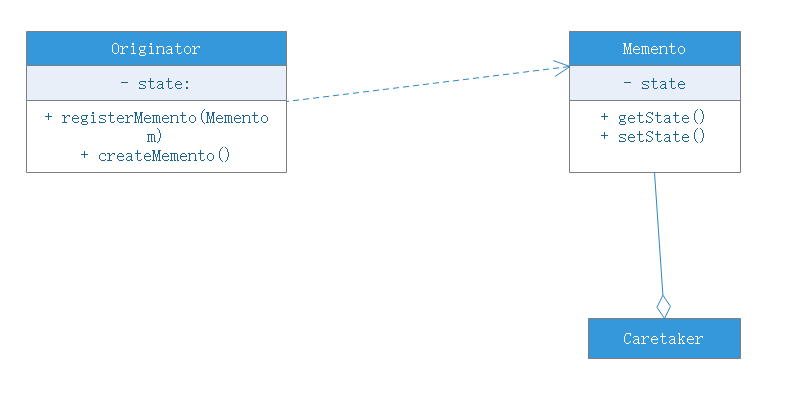

# 备忘录模式

## 模式概述
备忘录模式提供了一种状态恢复的实现机制，使得用户可以方便的回到某一个特定的历史步骤，当新的状态无效或者存在问题时，可以使用暂时存储起来的备忘录进行状态复原，当前很多软件都提供了撤销操作，其中就是备忘录模式。

## 模式定义
备忘录模式（Memento Pattern）：在不破坏封装的前提下，捕获一个对象的内部状态，并在该对象之外保存这个状态，这样可以在以后将对象恢复到原先保存的状态，是一种对象行为型模式，其别名为Token.

## 模式结构
备忘录模式包含如下角色：
- Originator（原发器）：它是一个普通类，可以创建一个备忘录，并存储它的当前内部状态，也可以使用备忘录来恢复其内部状态，一般将需要保存内部状态的类设计为原发器
- Memento（备忘录）：存储原发器的状态，根据原发器来决定保存哪些内部状态。备忘录的设计一般可以参考原发器的设计，根据实际需要确定备忘录类中的属性，除了原发器本身与负责人类之外，备忘录对象不能直接供其他类使用，原发器的设计在不同的编程语言中实现机制会有所不同
- Caretaker（负责人）：又称管理者，负责保存备忘录但是不能对备忘录的内容进行操作或检查。在负责人类中可以存储一个或多个备忘录对象，它只负责存储对象，而不能修改对象，也无需知道对象的实现细节

## 总结
备忘录模式在很多软件的使用过程中普遍存在，但是在应用软件开发中，使用频率并不高，因为现在很多窗体和浏览器的应用软件并没有提供撤销操作。如果需要为软件提供撤销操作，备忘录模式无疑是一种很好的解决方案。

通过将源发器和备忘录放在同一个包中，并且将备忘录类的访问修饰符置为default，就可以预防其他对象访问备忘录了。

### 优点
- 提供了一种状态恢复机制，使得用户可以方便地回到一个特定地历史步骤，当新的状态无效或存在问题时，可以使用暂时存储起来地备忘录将状态复原
- 备忘录模式实现了对信息的封装，一个备忘录对象是一个原发器对象状态的表示，不会被其他代码所改动。备忘录保存了原发器的状态，采用列表、堆栈等集合来存储备忘录对象可以实现多次撤销操作

### 缺点
资源消耗过大，如果需要保存的原发器的变量成员太多，就不可避免地需要占用大量地存储空间，没保存一次对象的状态都需要消耗一定的系统资源。

### 适用场景
- 保存一个对象在某一时刻的全部状态或部分状态，这样以后需要时它能够恢复到先前状态，实现撤销操作
- 防止外界对象破坏一个对象的历史状态的封装性，避免将对象历史状态的实现细节暴露给外界对象