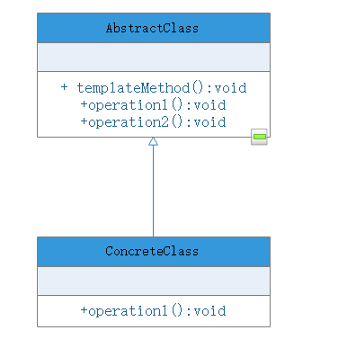

# 模板方法

## 模式动机
在软件开发中，有时也会遇到类似的情况，某个方法的实现需要多个步骤（类似“请客”），其中有些步骤固定（类似“点单”和“买单”），而有些步骤并不固定，存在可变性（类似“吃东西”）。为了提高代码的复用性和系统的灵活性，可以使用一个称之为模板方法模式的设计模式，在模板方法模式中，将实现功能的每一个步骤所对应的方法称为基本方法，而调用这些基本方法同时定义基本方法的执行次序的方法称为模板方法。在模板方法模式中，可以将相同的代码放在父类中，例如将模板方法“请客”以及基本方法“点单”和“买单”的实现放在父类中，而对于基本方法“吃东西”，在父类中只提供一个声明，将其具体实现放在不同的子类中，在一个子类中提供“吃面条”的实现，另一个子类提供“吃满汉全席”的实现。通过模板方法模式，一方面提高了代码的复用性，另一方面还可以利用面向对象的多态性，在运行时选择一种具体的子类，实现完整的“请客”方法，提高系统的灵活性和可扩展性。

## 模式定义
模板方法（Template Method Pattern）：定义一个操作中算法的框架，而将一些步骤延迟到子类中。模板方法模式使得子类可以不改变一个算法的结构即可重定义该算法的一些特定步骤。模板方法是一种**基于继承的代码复用技术，它是一种类行为模式。**

## 模式结构
- AbstractClass（抽象类）：在抽象类中定义了一系列基本步骤，这些基本步骤可以具体的，也可以是抽象的，每一个基本操作对应算法的一个步骤，在其子类中可以重定义或实现这些步骤。同时，在抽象类中实现了一个模板方法，定于定义一个算法的框架，模板方法不仅可以调用该抽象类中实现的基本方法，也可以调用在抽象类的子类中实现的方法，还可调用其他对象中的方法
- 它是抽象类的子类，用于实现在父类中声明的抽象基本操作以完成子类特定算法的步骤，也可以覆盖父类中已经实现了的基本操作

## 模板方法模式效果及适用场景
模板方法模式是基于继承的代码复用技术，它体现了面向对象的诸多重要思想，是一种适用较为频繁的模式。模板方法模式广泛应用于框架设计中，以确保父类控制处理流程的逻辑顺序（如框架的初始化、测试流程的设置等）。

### 模式优点
- 在父类中形式化地定义一个算法，而由它的子类来实现细节的效果，在子类实现详细的处理算法时并不会改变算法执行步骤的次序
- 模板方法是一种代码复用技术，它在类库设计中尤为重要，提取了类库中的公共行为，将公共行为放在父类中，而通过其子类实现不同的行为，它鼓励我们恰当使用继承来实现代码复用
- 可实现一种反向控制，通过子类覆盖父类的钩子方法来决定某一特定步骤是否需要执行
- 在模板方法模式中可以通过子类来覆盖父类的基本方法，不同的子类可以提供基本方法的不同实现，更换和增加新的子类很方便，符合单一职责原则和开闭原则

### 模式缺点
需要为每一个基本方法的不同实现提供一个子类，如果父类可变的基本方法太多，将会导致类的个数增加，系统更为庞大，设计也更加抽象，此时，可结合桥接模式来设计（将一个父类抽象分离为两个父类，然后对两个变化维度进行审视）

### 适用场景
- 对一些复杂的算法进行分割，将其算法中固定不变的部分设计为模板方法和父类具体方法，而一些可变的细节由子类实现。即：一次性实现一个算法的不变部分，并将可变的行为留给子类来实现
- 各子类中公共的行为应被提取出来并集中到一个公共的父类中以避免代码重复
- 需要通过子类来决定父类算法中某个步骤是否需要执行，实现子类对父类的反向控制