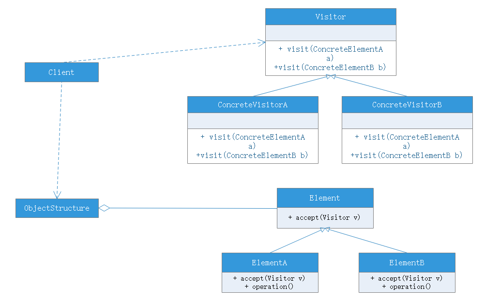
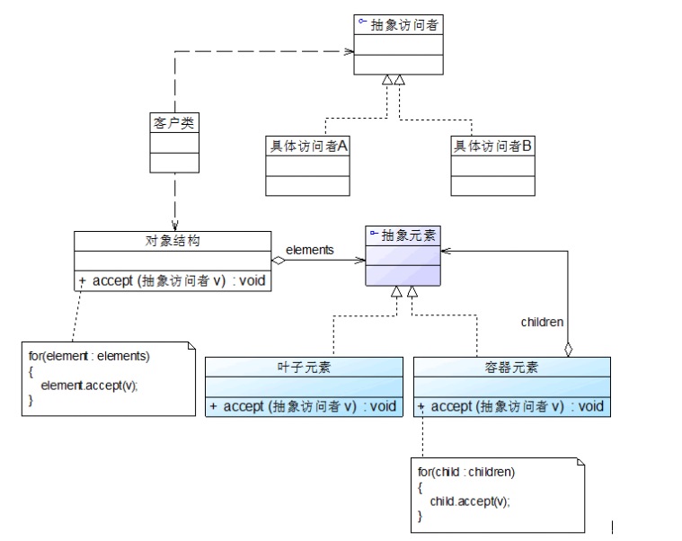

# 访问者模式

## 模式概述
访问者模式是一种较为复杂的行为型设计模式，它包含访问者和被访问者两个主要组成部分，这些被访问的元素通常具有不同的类型，且不同的访问者可以对它们进行不同的访问操作。例如处方单中的各种药品信息就是被访问的元素，而划价人员和药房工作人员就是访问者。访问者模式使得用户可以在不修改现有系统的情况下扩展系统的功能，为这些不同的元素增加新的操作。

在使用访问者模式时，被访问元素通常不是单独的，它们存储在一个集合中，这个集合被称为“对象结构”，访问者通过遍历对象结构实现对其中存储的元素逐个操作。

## 模式定义
访问者模式（Visitor Pattern）：提供一个作用于某对象结构中的各元素的操作表示，它使我们可以在不改变各元素的类的前提下定义作用于这些元素的操作。访问者模式是一种对象行为型模式。

## 模式结构
模式包含角色：
- Visitor（抽象访问者）
    - 抽象访问者为对象结构中每一个具体元素类ConcreteElement声明了一个访问操作，从这个操作的名称或参数类型可以清楚知道需要访问的具体元素的类型，具体访问者需要实现这些操作方法，定义对这些元素的访问操作
- ConcreteVisitor（具体访问者）
    - 具体访问者实现了每个由抽象访问者声明的操作，每一个操作用于访问对象结构中一种类型的元素
- Element（抽象元素）
    - 抽象元素一般是抽象类或者接口，它定义了一个accept()方法，该方法通常以一个抽象访问者作为参数
- ConcreteElement（具体元素）
    - 具体元素实现了accept()方法，在accept()方法中调用访问者的访问方法以便完成对一个元素的操作
- ObjectStructure（对象结构）
    - 对象结构是一个元素的集合，它用于存放元素对象，并且提供了遍历其内部元素的方法。它可以结合组合模式来实现，也可以是一个简单的集合对象，如一个List或者一个Set

访问者模式中，抽象访问者定义了访问元素对象的方法，通常为每一种类型的元素对象都提供一种访问方法，而具体访问者可以实现这些访问方法。这些访问方法的命令一般有两种格式：1.直接在方法名中标明待访问元素对象的具体类型。2.统一取名visit()，通过参数类型的不同来定义一系列重载的visit()方法。

对于元素类，一般都定义了一个accept()方法，用于接收访问者的访问。需要注意的是该方法传入了一个抽象访问者Visitor类型的参数，即针对抽象访问者进行编程，而不是具体访问者。在程序运行时再确定具体访问者的类型，并调用具体访问者对象的visit()方法实现对元素对象的操作。在抽象元素类Element的子类中实现了accept()方法，用于接收访问者的访问。

在具体元素类的ConcreteElementA的accept()方法中，通过调用Visitor类的visit()方法实现对元素的访问，并以当前对象作为visit()方法的参数，qi具体执行步骤如下：

1. 调用具体元素类的accept(Visitor visit)方法，并将visitor子类作为其参数
2. 在具体元素类accept(Visitor visit)方法内部调用传入的Visitor对象的visit()方法，如visit(ConcreteElementA)，将当前具体元素类对象(this)作为参数，如visitor.visit(this)
3. 执行Visitor对象的visit()方法，在其中还可以调用具体元素对象的业务方法

这种调用机制也叫“双重分派”，正因为双重分派机制，使得增加新的访问者无须修改现有类库代码，只需将新的访问者对象作为参数传入具体元素对象的accept()方法，程序运行时将回调新增Visitor类中定义的visit()方法，从而增加新的元素访问方式。

## 模式分析
访问者模式与抽象工厂模式类似，对于“开闭原则”的支持具有倾斜性，可以很方便的增加新的访问者，但是添加新的元素较为麻烦

## 模式扩展
- 访问者模式与组合模式联用

在访问者模式中，包含一个用于存储元素对象集合的对象结构，我们通常可以使用迭代器来遍历对象结构，同时具体元素之间可以存在整体与部分关系，有些作为容器元素，有些作为叶子元素，可以使用组织模式来组织元素，引入组合模式后的访问者模式如下：

需要注意，由于叶子节点的遍历操作已经在容器中完成，因此要防止单独将已增加到容器元素的叶子节点再次加入对象结构中，对象结构中只保存容器元素和孤立的叶子元素。

## 模式总结
由于访问者模式的使用条件较为苛刻，本身结构较复杂，因此实际使用的较少。当系统中存在一个较为复杂的结构，且不同访问者对其采用的操作也不相同，可以考虑使用访问者模式进行设计；在XML文档解析、编译器设计、复杂集合对象的处理等领域访问者模式得到一定应用。

### 优点
- 增加新的访问操作很方便，使用访问者模式，增加新的访问操作就意味着增加一个新的具体访问者类，实现简单，无须修改源代码，符合开闭原则
- 将有关元素对象的访问集中到一个访问者对象中，而不是分散在一个个元素类中。类的职责更加清晰，有利于对象结构中元素对象的复用，相同对象结构可以提供多个不同的访问者访问
- 让用户能够在不修改现有元素类层次结构情况下，定义作用于该层次的操作

### 缺点
- 增加新的元素类很困难，访问者模式中，每增加一个新的元素类都意味着要在抽象访问者角色增加一个新的访问操作，并在每一个具体访问者类中增加相应的具体操作，违背了开闭原则
- 破坏封装。访问者模式要求访问者对象访问并调用每一个元素对象的操作，这意味着元素对象有时必须暴露一些自己的内部操作和内部状态，否则无法提供访问者访问

### 适用场景
- **一个对象结构包括多个类型的对象**，希望对这些对象实施一些依赖某具体类型的操作，在访问者中针对每一种具体的类型都提供了一个访问操作，不同类型对象可以有不同的访问操作
- 需要对一个对象结构中的对象进行很多不同的并且不相关的操作，而且需要避免让这些操作“污染”这些对象的类，也不希望在增加新操作时修改这些类。访问者模式使得我们可以将相关的访问操作集中起来定义在访问者方法中，**对象结构可以被不同的访问者类所使用，将对象本身与对象的访问分离**
- 对象结构中对象对应的类很少改变，但经常需要在此对象结构上定义新的操作
