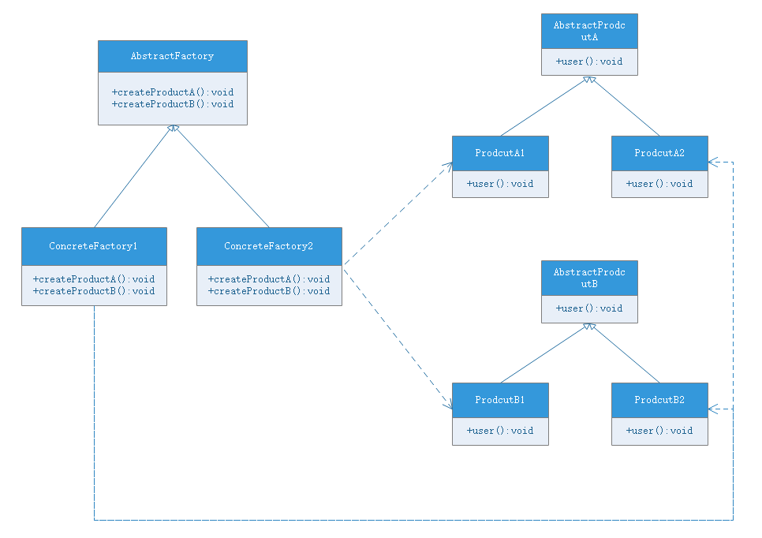

# 抽象工厂模式(abstract factory pattern)
## 模式动机
- 在工厂方法模式中，具体的工厂子类中一般只有一个工厂方法或者一组重载的工厂方法。但是有时候我们需要一个工厂可以提供多个产品对象，而不是单一的产品对象：
    - 产品等级结构：产品等级结构即产品的继承结构，如一个抽象类是电视机，其子类有海尔电视机、海信电视机、TCL电视机，则抽象电视机与具体品牌的电视机之间构成了一个产品等级结构，抽象电视机是父类，具体品牌电视机是子类
    - 产品族：抽象工厂模式中，产品族是指由同一个工厂生产的，**位于不同产品等级结构中的一组产品**，例如海尔电器工厂中的海尔电视机、海尔电冰箱，海尔电视机位于电视机产品等级结构中，海尔电冰箱则位于电冰箱产品等级结构中
- 当系统所提供的工厂所需要生产的产品并不是一个简单的对象，而是多个位于不同产品等级结构中属于不同类型的具体产品时需要使用抽象工厂模式
- 抽象工厂模式是所有形式的工厂模式中最位抽象和最具有一般形态的模式
- 抽象工厂模式与工厂模式最大的区别在于，工厂方法模式针对的是一个产品等级结构，而抽象工厂模式则需要面对多个产品等级结构，一个工厂等级结构可以负责多个不同产品等级结构的一个产品族中的所有对象时，抽象工厂模式比工厂方法模式更简单、有效

## 模式定义
抽象工厂模式提供一个创建**一系列相关或相互依赖对象**(产品族)的接口，而无须指定它们具体的类，属于**对象创建模式**

## 模式结构
抽象工厂模式包含如下角色：
- [AbstractFactory](AbstractFactory.java) ：抽象工厂
    - 提供方法用于创建产品族
- ConcreteFactory：具体工厂
- [Product](ProductA.java) ：抽象产品
- ConcreteProduct：具体产品

## 模式优点
- 抽象工厂模式隔离了具体类的生成，使得客户并不需要知道什么被创建。由于这种隔离，更换一个具体工厂就变得相对容易。所有的具体工厂都实现了抽象工厂中定义的那些公共接口，因此只需要改变具体工厂的实例，就可以在某种程度上改变整个软件系统的行为。应用抽象工厂模式可以实现**高内聚低耦合**的设计目的，因此抽象工厂模式得到广泛应用
- 增加新的具体工厂和产品族无须修改现有系统符合开闭原则
- 当一个产品族中的多个对象被设计成一起工作时，它能够保证客户端始终只使用同一个产品族中的对象。这对一些需要根据当前环境来决定其行为的软件系统来说，是一种非常实用的设计模式

## 模式缺点
- 在添加新的产品对象时，难以扩展抽象工厂来生产新种类的产品，这是因为在抽象工厂中规定了所有可能被创建的产品集合，要支持新种类的产品就意味着要对该接口进行扩展，而这将涉及对抽象工厂角色及其所有子类的修改，显然会带来较大的不便
- 开闭原则的倾斜性(增加新的工厂和产品族更容易，增加新的产品等级结构麻烦)

## 适用环境
- 一个系统不应该依赖于产品实例如何被创建、组合和表达的细节，这对所有类型的工厂模式都很重要
- 系统中有多于一个的产品族，而每次只使用其中某一产品族
- 属于同一个产品族的产品将在一起使用，这一约束必须在系统的涉及中体现出来
- 系统提供一个产品类的库，所有的产品以同样的接口出现，从而使客户端不依赖于具体实现

## 模式应用
很多软件系统中需要更换界面主题，要求界面中的按钮、文本框、背景色等一起发生改变，可以使用抽象工厂模式。

## 模式扩展
- 开闭原则的倾斜性
    - 抽象工厂模式的这种性质称为“开闭原则”的倾斜性，对增加产品族提供方便，但是新增产品等级结构将导致原有抽象工厂结构发生变化，实现接口方法的子类必须重新实现其新增的方法
- 工厂模式退化
    当抽象工厂模式中的每一个具体工厂类只创建一个产品对象，也就是只存在一个产品等级结构时，抽象工厂模式退化成工厂方法模式；当工厂方法模式中抽象工厂与具体工厂合并，提供一个统一的工厂来创建对象，并将创建对象的方法改为静态的，工厂方法模式退化位简单工厂模式

