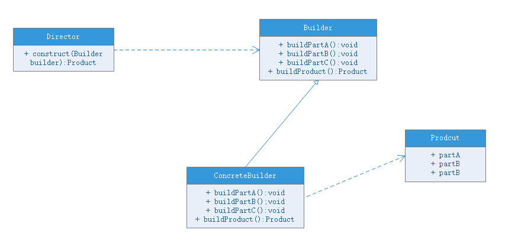

# 建造者模式(Builder Pattern)
## 模式动机
无论是在现实世界中还是软件系统中，都存在一些复杂对象，它们拥有多个组成部分，如汽车，包括车轮、方向盘、发送机等各种部件。而对于大多数用户而言，无须知道这些部件的装配细节，也几乎不会使用单独某个部件，而是使用一辆完整的汽车，可以通过建造者模式对其进行设计与描述，建造者模式可以将部件和其组装过程分开，一步一步创建一个复杂的对象。用户只需要指定复杂对象的类型就可以得到该对象，而无须知道其内部构造细节。

在软件开发中，也存在大量类似汽车一样的复杂对象，它们拥有一系列成员属性，这些成员属性中有些是引用类型的成员对象。而在这些复杂对象中，还可能存在一些限制条件，如某些属性没有赋值则复杂对象不能作为一个完整的产品使用；有些属性的赋值必须按照某个顺序进行，一个属性没有赋值之前，另一个属性可能无法赋值等。

复杂对象相当于有待建造的汽车，而对象属性相当于汽车的部件，建造汽车的过程就相当于组合部件的过程。由于组合部件的过程很复杂，这些**部件的组合往往被“外部化”到一个称作建造者的对象里**，建造者返还给客户端的是一个已经建造完毕的完整产品对象，而用户无须关心该对象所包含的属性以及它们的组装方式，这就是建造者模式的模式动机。

## 模式定义
建造者模式：将一个复杂对象的构建与它的表示分离，使得同样的构建过程可以构建不同的表示。

建造者模式是一步一步创建一个复杂的对象，它允许用户只通过指定复杂对象的类型和内容就可以构建它们，用户不需要知道内部的具体构建细节。建造者模式属于对象创建型模式。根据中文翻译的不同，建造者模式又可以称为生成器模式。

## 模式结构
建造者模式包含如下角色：
- [Builder](Builder.java) ：抽象创建者
    - 给出一个抽象结论，以规范产品对象的各个组成成分的建造。这个接口规定要实现复杂对象哪些部分的创建，并不涉及具体的对象部件的创建
- [ConcreteBuilder](ConcreteBuilder.java) ：具体的创建者
    - 实现Builder抽象类或接口，针对不同的商业逻辑，具体化复杂对象的各部分的创建，**在构建过程完成后，提供产品的实例**
- [Director](Director.java) ：指挥者
    - 调用具体建造者来创建复杂对象的各个部分，在指导者中不涉及具体产品的信息，只负责保证对象各部分完整创建或者按某种顺序创建
- [Product](Product.java) ：产品角色
    - 要创建的复杂对象，含有复杂的对象属性

## 模式分析
- 抽象建造者类中定义了产品的创建方法和返回方法
- 建造者模式中定义的Director即指挥者类，该类有两个作用：1.隔离了客户与生产过程。2.控制了产品的生成过程。指挥者针对抽象建造者编程，客户都按只需要知道建造者的类型，即可通过指挥者类调用调用者的方法，返回一个完整的产品对象
- 客户代码中，无须知道产品对象的创建和组装过程，只需确定具体建造者的类型即可，建造者模式将复杂对象的创建和对象的表现分离开来，这样使得同样的构建过程可以创建出不同的表现

## 模式优点
- 在建造者模式中，客户端不必知道产品内部组成的细节，将产品本身与产品的创建过程解耦，使得相同的创建过程可以创建不同的产品对象
- 每一个具体建造者都相对独立，而与其他建造者无关，因此可以很方便地替换具体建造者或增加新的具体建造者，用户使用不同的具体建造者即可得到不同的产品对象
- 可以更加精细地控制产品的创建过程。将复杂产品的创建步骤分解在不同的方法中，使得创建过程更加清晰，也更方便使用程序来控制创建过程
- 增加新的具体建造者无须修改原有类库的代码，指挥者类针对抽象建造者编程，系统拓展方便，符合开闭原则

## 模式缺点
- 建造者模式所创建的产品一般具有较多的共同点，其组成部分类似，如果产品之间的差异性很大，则不适合使用创建者模式，因此其使用范围受到一定程度的限制
- 如果产品的内部变化复杂，可能会导致需要定义很多具体建造者类来实现这种变化，导致系统变得臃肿

## 适用环境
- 需要生产的产品对象内部组成结构较复杂，通常包含多个成员属性
- 需要生产的产品对象属性相互依赖，需要指定其生成顺序
- 对象的创建过程独立于创建该对象的类。在建造者模式中引入了指挥者类，将创建过程封装在指挥者类中而不是建造者类中
- 隔离复杂对象的创建和使用，并使得相同的创建过程可以创建不同的产品对象

## 模式扩展
建造者模式的简化：
- 省略抽象建造者角色：如果系统中只需要一个具体建造者，可以省略掉抽象建造者
- 省略指挥者角色：如果抽象建造者被省略掉了，那么指挥者角色也可以被省略，让Builder角色扮演建造者和指挥者双重角色

建造者模式与抽象工厂模式的比较：
- 与抽象工厂模式相比，建造者模式返回一个完好的产品，而抽象建造者返回一系列相关的产品，这些产品位于不同的产品等级结构，构成了一个产品族
- 在抽象工厂模式中，客户端实例化工厂类，然后调用工厂方法获取所需产品对象，而在建造者模式中，客户端可以不直接调用建造者的方法，而是通过指挥者类来指导如何生成对象，包括对象的**组装过程和建造步骤**，它侧重于一步步构造一个复杂对象，返回一个完整对象
- 如果将抽象工厂模式看成**汽车配件生产工厂**，生产一个产品族的产品，那么建造者模式就是**汽车组装工厂**，通过对部件的组装可以返回一个完整的汽车