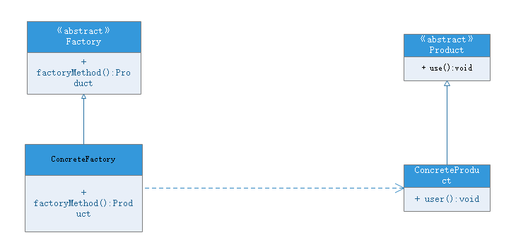

# 工厂方法模式(factory method pattern)
## 模式动机
现在对简单工厂模式做出一定改进，不再设计一个工厂类进行对象的创建，而是将具体按钮创建的过程交给专门的工厂子类去完成，先定义一个抽象的按钮工厂类，再定义具体的工厂类来生成诸如圆形按钮、矩形按钮等，它们实现在抽象工厂类里面定义的方法。这种抽象化的结果使这种结构可以在不修改具体工厂类的情况下引进新的产品。如果出现新的按钮类型，只需要为这种新类型的按钮创建一个具体的工厂类就可以获得该新按钮的实例，这一改进使得工厂类更具开闭原则。

## 模式定义
工厂方法模式又称为工厂模式，也叫虚拟构造器模式或**多态工厂模式**，属于**类创建型模式**。在工厂方法模式中，抽象父类负责创建产品对象的公共接口，子类工厂负责具体产品的创建，这样做的目的时将产品类的实例化延迟到工厂子类中进行，即通过工厂子类确定究竟该实例化哪一个产品对象。

## 模式结构
工厂方法包含如下角色：
- [Product](Product.java) ：抽象产品
- [ConcreteProduct](Book.java) ：具体的产品
- [Factory](Factory.java) ：抽象工厂父类
- [ConcreteFactory](BookFactory.java) ：具体实例化产品的工厂子类



## 模式分析
工厂方法模式是简单工厂模式的进一步抽象和推广，由于使用了面向对象的多态性，工厂方法模式保持了简单工厂模式的优点，克服了缺点。在工厂方法模式中，核心的工厂类不再负责具体产品的创建，而是将创建的步骤延伸到具体的工厂子类中进行，工厂类只提供给工厂子类方法，这让工厂方法模式可以允许系统再不修改角色的情况下引进新产品。

## 工厂方法模式优点
- 在工厂方法模式中，工厂方法用来创建客户所需要的产品，同时还向客户隐藏了哪种具体产品类将被实例化这一细节，用户只需要关心**所需产品对应的工厂**，无须关心创建细节，甚至无须知道创建实例的类名
- 工厂角色和产品角色的多态性设计是工厂方法模式的关键，它使得工厂可以自主确定创建何种产品对象，而如何创建这个对象的细节交给工厂子类。工厂方法模式之所以又被称为多态工厂模式，是因为所有的具体的工厂类都具有同一个抽象父类工厂类
- 使用工厂方法模式的另一个优点是在系统中加入新产品时无须修改现有工厂子类，只需要创建新的工厂子类来创建新产品，系统的可扩展性变得更好，完全符合开闭原则

## 工厂方法模式的缺点
- 在添加新产品时，需要编写新的工厂子类和新的具体产品类，系统中类的个数将成对增加，在一定程度上增加了系统的复杂度，有更多的类需要编译和运行，给系统增加了额外的开销
- 由于考虑到系统的可拓展性，需要引入抽象层，在客户端代码中均使用抽象层进行定义，增加了系统的抽象性和理解难度

## 使用环境
- 一个类不知道它所需要的对象的类，客户端只需要知道具体工厂类即可
- 一个类通过其子类来创建对象，利用里式代换原则和面向对象的多态性，在程序运行时，子类对象将覆盖父类对象，从而使得系统更容易拓展
- 将创建对象的任务委托给多个工厂子类中的一个，客户端在使用时可以无须关心哪一个工厂子类创建了产品，需要时再动态指定，可以将具体工厂类的类名存储在配置文件或数据库中

## 模式应用
JDBC中的工厂方法：
```java
Connection conn=DriverManager.getConnection("jdbc:microsoft:sqlserver://loc
alhost:1433; DatabaseName=DB;user=sa;password=");
Statement statement=conn.createStatement();
ResultSet rs=statement.executeQuery("select * from UserInfo");
```

## 模式拓展
- 使用多个工厂方法：在抽象工厂角色可以定义多个工厂方法，从而使具体工厂角色实现这些不同的工厂方法，这些方法可以包含不同的业务逻辑，以满足对不同的产品对象的需求
- 产品对象的重复使用：工厂对象将已经创建过的产品保存到一个集合中，然后根据客户对产品的请求，对集合进行查询。如果有满足要求的产品对象，就直接将该产品返回客户端；如果集合中没有这样的对象，那么就创建一个新的满足要求的产品对象，然后将这个对象增加到集合中，再返回给客户端
- 多态性的丧失和模式的退化：如果工厂仅仅返回一个具体产品对象，便违背了工厂方法的用意，发生退化此时就不再时工厂方法模式了。一般来说，工厂对象应当有一个抽象的父类型，如果工厂等级结构中只有一个具体工厂类的话，抽象工厂就可以省略，也将发生退化。当只有一个具体工厂，在具体工厂中可以创建所有的产品对象，并且工厂方法设计为静态方法时工厂方法模式退化为简单工厂模式
