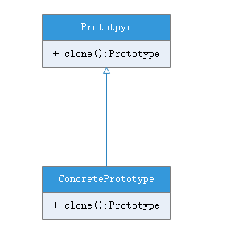

# 原型模式(prototype pattern)
## 模式定义
使用原型实例指定创建对象的种类，并且通过拷贝这些原型创建新的对象。

模式的要点在于实现拷贝的实现方法。

## 模式结构
模式包含如下角色：
- [Prototype](Prototype.java) ：抽象原型接口，用于定义一个克隆自身的接口
- [ConcretePrototype](ConcretePrototype.java) ：实现一个克隆自身的操作

## 模式分析
Prototype有许多和Abstract Factory和Builder一样的效果：它对客户隐藏了具体的产品类，因此减少了客户知道的名字的数目。这些模式让客户无须改变即可使用与特定应用相关的类。

客户请求一个原型克隆自身，克隆方法有浅拷贝和深拷贝两种，通常所说的浅拷贝是指仅仅拷贝指向原型对象的引用，当修改原型对象时拷贝的原型访问原型对象的值也会改变，因为实际上的浅拷贝根本没有进行对象的拷贝，深拷贝不仅拷贝了对象的引用，还在堆空间上重新复制了一份原型对象，让拷贝的原型对象引用指向这个新原型对象。

## 模式优点
- 运行时增加和删除产品
- 改变值以指定新对象
- 改变结构以指定新对象
- 减少子类的构造
- 用类动态配置应用

## 模式缺点
- 每一个Prototype的子类必须实现Cloneable接口
    - 当所考虑的类已经存在时就难以新增Clone操作
    - 当内部包括一些不支持拷贝或有循环引用的对象，实现克隆也比较困难