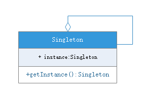

# 单例模式(singleton pattern)
## 模式动机
对于系统中的某些类来说，只有一个实例很重要，例如，一个系统可以有多个打印任务，但是只能有一个正在工作的任务。

如何保证一个类只有一个实例并且这个实例易于被访问呢？定义一个全局变量可以保证对象随时可以被访问，但不能防止我们实例化多个对象。

一个更好的解决办法是让**类自身负责保存它的唯一实例**，这个类可以确保没有其他实例被创建，并且它可以提供一个访问该实例的方法，这就是单例模式的动机。

## 模式定义
单例模式(Singleton Pattern)：单例模式确保某一个类只有要给实例，而且自行实例化并向系统提供这个实例，这个类称为单例类，它提供全局访问的方法。

单例模式要点：
1. 某个类只能有一个实例
2. 它必须自行创建实例
3. 它必须向系统提供访问实例的方法

单例模式是对象创建模式。

## 模式结构
- [Singleton](Singleton.java)：单例

## 模式分析
单例模式的目的是保证一个类仅有一个实例，并提供一个访问它的全局访问点。单例模式包含的角色只有一个——单例类。单利模式拥有一个**私有构造函数**，确保用户无法通过new关键字直接实例化。除此之外，该模式中包含一个静态私有成员变量和静态公有的工厂方法，该工厂方法负责检验实例的存在性并实例化自己，然后存储在静态私有成员变量中，以确保只有一个实例生成。

需要注意三点：
- 单例类的构造函数指名为私有
- 提供一个自身的静态私有成员变量
- 提供一个公有的静态工厂方法

## 模式优点
- 提供了对唯一实例的受控访问，因为单例类封装了它的唯一实例，所以它可以严格控制客户怎样以及何时访问它，并为设计及开发团队提供了共享的概念
- 由于在系统内存中只存在一个对象，因此可以节约系统资源，对于一些需要频繁创建和销毁地对象，单例模式无疑可以提高系统性能
- 允许可变数目的实例，我们可以基于单例模式进行扩展，使用与单例模式控制相似的方法来获得指定个数的对象实例

## 模式缺点
- 由于单例模式中没有抽象层，因此单例类的扩展比较困难
- 单例类的职责过重，在一定程度上违背了单一指责原则。因此单例类既充当了工厂角色，提供了工厂方法，又充当产品角色，包含一些业务方法，将产品的创建和产品本身的工程融合到一起
- 滥用单例将带来一些负面问题，如为了节省资源将数据库连接池对象设计为单例类，可能会导致共享连接池对象过多而出现连接池溢出；Java的运行环境提供了自动垃圾回收，如果实例化的对象长时间不用，系统会认为它是垃圾，会自动销毁并回收，下次利用时又将重新实例化，这将导致对象状态的丢失

## 适用环境
- 系统只需要一个实例对象，如系统要求提供一个唯一的序列号生成器，或者需要考虑资源消耗太大而只允许创建一个对象
- 客户调用类的单个实例只允许使用一个公共访问点，除了该公共访问点，不能通过其他途径访问该实例
- 一个系统要求只有一个类只能有一个实例才用该模式，反之，当系统需求为多个实例就使用多例

## 模式应用
一个具有自主编号主键的表可以有多个用户使用，但数据库中只能有一个地方分配下一个主键编号，否则会出现重复，因此该主键编号生成器必须具备唯一性，可以通过单例模式。