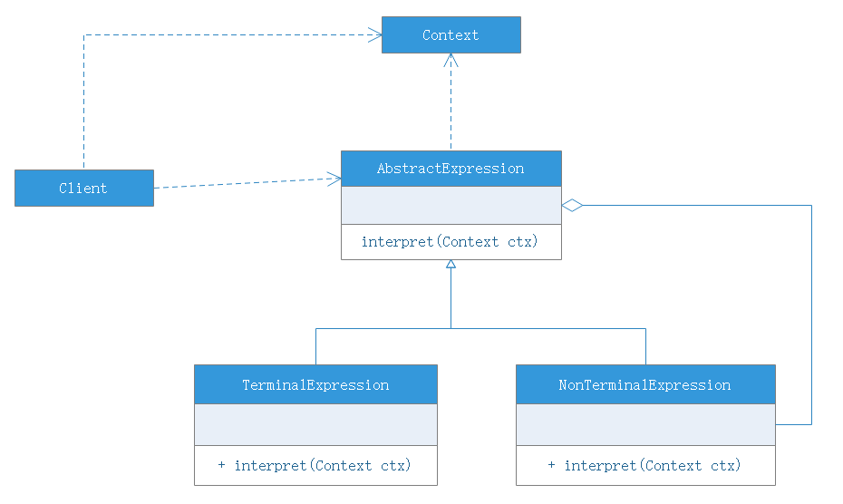
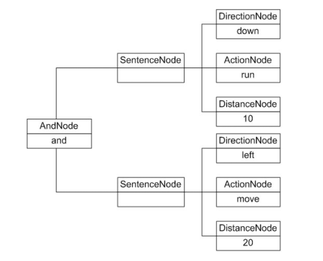

# 解释器模式

## 模式概念
解释器模式描述了如何为简单的语言定义一个文法，如何在该语言中表示一个句子，以及如何解释句子。

下面通过一个例子来学习如何表示一个语言的文法规则以及如何构造一棵**抽象语法树**。

```
expression ::= value|option
option ::= expression '+' expression|expression '-' expression
value ::= an integer //一个整数值
```
对于一个输入表达式"1 + 2 + 3 - 4 + 1"，可以用如上文法规则来定义，第一条表示表达式的组合，其中value和option是后面两个语言单位的定义，每一条语句所定义的字符串如option和value称为语言构造成分或语言单位，符号"::="表示"定义为"的意思，其左边的语言单位通过右边来进行说明和定义，语言单位对应终结符表达式和非终结符表达式。如本规则中的operation是非终结符表达式，它的组成仍然可以是表达式，可以进一步分解，而value是表达式终结符，它的组成元素是最基本单位，不能再进行分解。

在文法规则定义中可以使用一些符号来表示不同的含义，如使用"|"表示或，使用"{"和"}"表示组合，使用"*"表示0个或多个，其中使用频率最高的符号是表示"或"关系的"|"，如文法规则"boolValue ::= 0|1"表示终结符boolValue的取值可以是0或1。

除了使用文法规则来定义一个语言，在**解释器模式**中还可以通过一种称之为**抽象语法树(Abstract Syntax Tree)**的图形方式来直观地表示语言地构成，每一棵抽象语法树对应一个语言实例，如加法/减法表达式语言中地语句"1+2+3-4+1"通过抽象语法树来表示：


在该抽象语法树中，可以通过终结符表达式value和非终结符表达式operation组成复杂地语句，每个文法规则的语言实例都可以表示为一个抽象语法树，即每一条具体的语句都可以用类似于上图所示的抽象语法树表示，在图中终结符表达式类的实例作为树的叶子节点，而非终结符表达式类的实例作为非叶子节点，它们可以将终结符表达式类的实例以及包含终结符的非终结符实例的子表达式作为其子节点。抽象语法树描述了如何构成一个复杂的句子，通过对抽象语法树的分析，可以识别出语言中的终结符类和非终结符类。

## 模式概述
解释器模式是一种使用频率相对较低单学习难度较大的设计模式，**它用于描述如何使用面向对象语言构成一个简单的语言解释器**。在某些情况下，为了更好地描述某一特定类型的问题，我们可以创建一种新的语言，这种语言拥有自己的表达式和结构--->即文法规则，这些问题的实例将对应为该语言中的句子。此时，可以使用解释器模式来设计这种新的语言。**对解释器模式的学习能够加深我们对面向对象思想的理解，并且掌握编程语言中文法规则的解释过程**。

## 模式定义
解释器模式(Interpreter Pattern)：定义一个语言的文法，并且建立一个解释器来解释该语言中的句子，这里的"语言"是指定使用规定格式和语法的代码，解释器模式是一中类行为模式。

## 模式结构
由于表达式可分为终结符表达式和非终结符表达式，因此解释器模式的结构与组合模式的结构有些类似，但在解释器模式中包含更多的组成元素，包含如下角色：
- AbstractExpression（抽象表达式）：在抽象表达式中声明了抽象的解释操作，它是所有终结符表达式和非终结符表达式的公共父类
- TerminalExpression（终结符表达式）：终结符表达式是抽象表达式的子类，它实现了与文法规则中的终结符相关联的解释操作，在句子中的每一个终结符都是该类的一个实例。通常在于给解释器模式中只有少数几个终结符表达式，它们的实例可以通过非终结符表达式组成较为复杂的句子
- NonTerminalExpression（非终结符表达式）：非终结符表达式也是抽象表达式的子类，它实现了文法规则中非终结符解释操作，由于在非终结符表达式中可以包含终结符表达式，也可以进行包含非终结符表达式，因此其解释操作一般通过递归操作来完成
- Context（环境类）：又称为上下文类，用于存储解释器之外的一些信息，通常它临时存储了需要解释的语句



在解释器模式中，每一种终结符和非终结符都有一个具体类与之对应，正因为使用类来表示每一条文法规则，所以系统将具有较好的灵活性和可扩展性。

## 模式应用
为了能够解释机器人指令，Sunny软件公司开发人员使用解释器来设计和实现机器人控制程序。针对五条文法规则，分别提供五个类来实现，其中终结符表达式direction、action和distance对应的类为DirectionNode、ActionNode和DistanceNode，非终结符表达式expression和sentence对应的类为AndNode和SentenceNode。

通过抽象语法树来表示具体解释过程，例如机器人控制指令"down run 10 and left move 20"对应的语法树为：



## 模式分析
在解释器模式中，环境类Context用于存储解释器之外的一些全局信息，通常作为参数被传递到所有表达式的解释方法中，可以在Context对象中存储和访问表达式解释器的状态，向表达式解释器提供一些全局的、公共的数据，此外还可以在Context中增加一些所有表达式解释器都共有的功能，减轻解释器的职责。

## 总结
解释器模式为自定义语言的设计和实现提供了一种解决方案，它用于定义一组文法规则并通过这组文法规则来解释语言中的句子。虽然解释器模式的使用频率不是特别高，但是**它在正则表达式、XML文档解释**等领域得到广泛应用。

### 优点
- 易于改变和拓展文法。由于在解释器中使用类来表示语言的文法规则，因此可以通过继承机制来改变或拓展文法
- 每一条文法规则都对应一个类，因此可以方便的实现一个简单的语言
- 实现文法较为容易
    - 在抽象语法树中每一个节点类的实现方式都是类似的，这些类的代码编写都不会太复杂，还可以通过一些工具自动生成节点类代码
- 增加新的解释表达式比较方便
    - 如果用户需要增加新的解释表达式只需要对应增加一个新的终结符表达式或非终结符表达式类，原有表达式类无须修改，符合开闭原则

### 缺点
- 复杂文法难以维护
- 执行效率较低
    - 解释器模式中使用了大量的循环和递归

### 适用场景
- 可以将一个需要解释执行的语言中的句子表示为一个抽象语法树
- 一些重复出现的问题可以用一种简单的语言来进行
- 一个语言的文法规则比较简单
- 执行效率不是问题