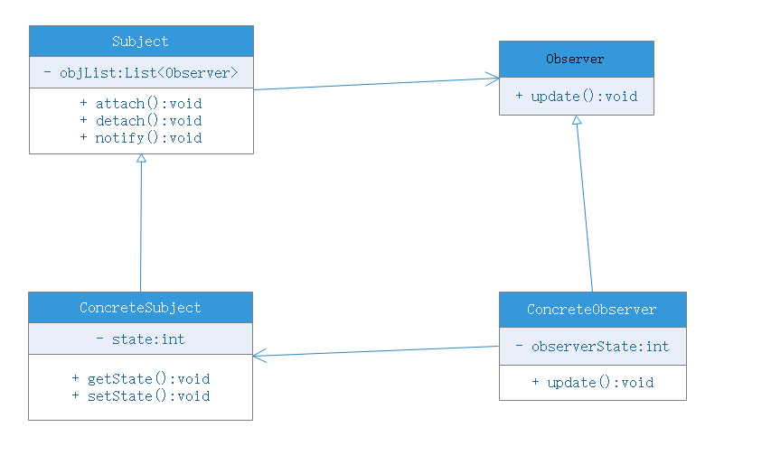
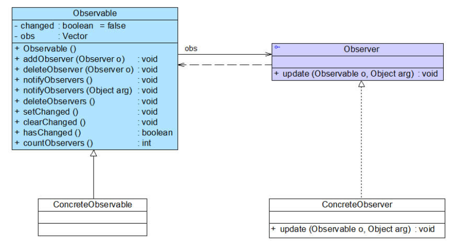

# 观察者模式

## 模式动机
建立一种对象与对象之间的依赖关系，一个对象发生改变时将自动通知其他对象，其他对象将相应做出反应。在此，发生改变的对象称为观察目标，而被通知的对象称为观察者，一个观察目标可以对应多个观察者，而且这些观察者之间没有相互联系，可以根据需要增加和删除观察者，使得系统更易于拓展，这就是观察者模式的模式动机

## 模式定义
观察者模式（Observer Pattern）：定义对象间的一种一对多依赖关系，使得每当一个对象状态发生改变时，其相关依赖对象皆得到通知并被**自动更新**。观察者模式又叫作发布-订阅模式、模型-视图模式、源-监听模式或者从属者模式，观察者模式是一种行为型模式。

## 模式结构
观察者具有如下角色：
- Subject：目标
    - 目标又被称为主题，它是指被观察的对象，在目标中定义了一个观察者集合，一个观察目标可以接受任意数量的观察者来观察，它提供了一系列方法来增加和删除观察者对象，同时定义了一个notify()方法，目标类可以是一个接口也可以抽象类或具体类
- ConcreteSubject：具体目标
    - 具体目标是目标的子类，通常它包含有经常发生改变的数据，当它的状态发生改变时，向它的各个观察者发出通知；同时它还实现了在目标类中定义的抽象逻辑业务方法。如果无须扩展目标类，在具体目标类可以省略
- Observer：观察者
    - 观察者将对观察目标的改变做出反应，观察者一般定义为接口，该接口声明了更新数据的方法update()，因此又称为抽象观察者类
- ConcreteObserver：具体观察者
    - 在具体观察者中维护了一个指向具体目标对象的引用，它存储了具体观察者的有关状态，这些状态需要和具体目标的状态保持一致；它实现了在抽象观察者Observer中定义的update()方法。通常在实现时，可以调用具体目标类的attach()方法将自己添加到目标类的集合中或通过delete()方法将自己从目标类的集合去查

## 模式分析
- 观察者模式描述了如何建立对象与对象之间的依赖关系，如何构造满足这种需求的系统
- 这一模式中的关键对象是观察目标和观察者，一个目标可以有任意数目的与之相关联的观察者,一旦目标的状态发生改变，所有的观察者都将得到通知
- 作为对这个通知的响应，每个观察者都将即时更新自己的状态，以与目标同步，这种交互也称发布-订阅（publish-subscribe）。目标是通知的发布者，它发出通知时并不需要知道谁是它的观察者，可以有任意数量的观察者订阅它并接收通知

## 实例
观察者模式在Java中的地位非常重要，在JDK的java.util包中，提供了Observable类以及Observer类，构成了JDK对观察者模式的支持

我们可以通过继承或实现来在java里面适用观察者模式

## 优点
- 观察者模式可以实现表示层和数据逻辑层分离，并定义了稳定的消息传递机制，抽象了更新接口使得可以有各种各样不同的表示层作为具体观察者角色
- 观察者模式在观察目标和观察者之间建立了一个抽象的耦合
- 观察者模式支持广播通信
- 符合开闭原则

## 缺点
- 如果一个观察的目标对象和很多个观察者直接或间接的关联，那么所有观察者都通知到会花费很多时间
- 如果观察者和目标之间有循环依赖，会导致系统崩溃
- 观察者模式没有相应的机制让观察者知道所观察的目标是怎么变化的，而仅仅只是知道观察目标发生了变化

## 适用环境
- 一个抽象模型有两个方面，其中一个方面依赖另一个方面，将这些方面封装在独立的对象中使它们可以各自独立的改变和复用
- 一个改变的状态将导致其他一个或多个对象也发生改变，而不知道具体有多少对象发生改变，可以降低对象之间的耦合度
- 一个对象必须通知其他对象，而不知道这些对象是谁
- 需要在系统中创建一个触发链，A对象的行为将影响B对象，B的行为影响C。。。可以使用观察者模式创建一种链式触发机制

## 模式应用
观察者模式在软件开发中应用非常广泛，如某电子商务可以在发送操作后给多个用户发送商品打折信息，某团队战斗游戏中某队友牺牲将给所有成员提示等等，凡是涉及到一对一、一对多的对象交互场景都可以使用观察者模式