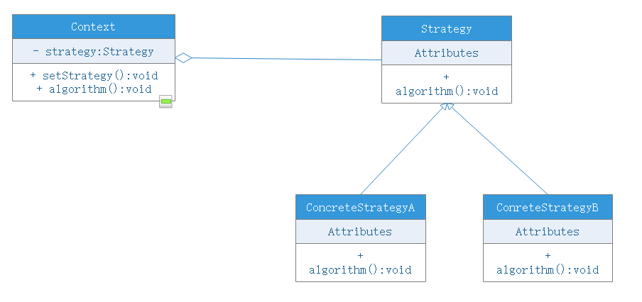

# 策略模式

## 模式动机
- 完成一项任务，往往可以有多种不同的方式，每一种方式称为一种策略，我们可以根据环境或者条件的不同选择不同的策略来完成该任务
- 在软件开发中也常常遇到类似情况，实现某一功能有多个途径，此时可以使用一种设计模式来使得系统可以灵活地选择解决途径，也能够方便地增加新的解决途径
- 在软件系统中，有许多算法可以实现某一功能，如查找、排序等，一种常用的方法是硬编码（Hard Code）在一个类中，如需要提供多种查找算法，可以将这个算法写到一个类中，在该类中提供多个方法，每一个方法对应一个具体地查找算法；当然也可以将这些查找算法封装在一个统一的方法中，通过if...else...等条件判断语句来进行选择，这两种实现方法我们都可以称之为硬编码，如果需要增加一种新的查找算法，需要修改封装算法类的源代码；更换查找算法，也需要修改客户端调用的代码。在这个算法类中封装了大量的查找算法，该类代码较复杂，维护较为困难
- 为了解决这些问题，可以定义一些独立的类来封装不同的算法，每一个类封装一个具体的算法，在这里，每一个封装算法的类我们都可以称之为策略（Strategy），为了保证这些策略的一致性，一般会用一个抽象的策略类来作算法的定义，而具体每种算法则对应于一个具体策略类

## 模式定义
策略模式（Strategy）：定义一系列算法，将每一个算法封装起来，并让它们可以相互替换。策略模式让算法独立于使用它的客户而变化，也称为政策模式（Policy），策略模式一种对象行为型模式。

## 模式结构
- Context：环境类
- Strategy：抽象策略类
- ConcreteStrategy：具体策略类

## 模式分析
- 策略模式是一个比较容易理解和使用的设计模式，策略模式是对算法的封装，它把算法的责任和算法本身分隔开，委派给不同的对象管理。策略模式通常把一个系列的算法封装在一系列的策略类里面，作为要给抽象策略类的子类。用一句话说：准备一组算法，并将每一个算法封装起来，使得它们可以互换
- 在策略模式中，应当由客户端自己决定什么情况下使用什么角色
- 策略模式仅仅封装算法，提供新算法插入到已有系统，以及老算法从系统中“退休”的方便，策略模式并不决定何时使用何种算法，算法的选择由客户端来决定。这在一定程度上提高了系统的灵活性，但是客户端需要理解具体的策略类之间的区别，以便选择合适的算法，这也是策略类的缺点之一，在一定程度上增加了客户类的使用难度

## 优点
- 提供了对“开闭原则”的完美支持，用户可以在不修改原有系统的基础上选择算法或行为，也可以灵活地增加新的算法或行为
- 提供了管理相关算法族的行为
- 提供了可以替换继承关系的方法
- 使用策略模式可以避免多重条件语句转移条件

## 缺点
- 客户端必须知道所有策略类，并自行决定使用哪一个
- 策略模式将会产生很多策略类，可以通过享元模式在一定程度上减少对象数量

## 适用环境
- 一个系统有许多类，它们之间的区别仅仅在于它们的行为，那么使用策略模式可以动态的让一个对象在许多行为中选择一种行为
- 一个系统需要动态的在几种算法中选择一种
- 如果一个对象有很多行为，如果不用恰当的模式，这些行为就只好使用多重的条件选择语句来实现
- 不希望客户知道复杂的、与算法相关的数据结构，在具体策略类中封装算法和相关的数据结构，提高算法的保密性和安全性

## 模式扩展
- 可以通过环境类状态的个数来决定是使用策略模式还是状态模式
- 策略模式的环境类自己选择一个具体策略类，具体策略类无须关心环境类；而状态模式的环境类由于外在因素需要放进一个具体状态中，以便通过其方法实现状态的切换，因此环境类和状态类之间存在一种双向关联
- 使用策略类，客户需要知道具体的策略类的功能；使用状态类，客户无须知道具体状态，环境类的状态会根据用户的操作自动转换
- 如果系统中某个类的对象存在多种状态，不同状态下行为有所差异，而且这些状态之间可以发生转换则用状态模式；如果系统中某个列的某一行为存在多种实现方式，而且这些实现方式可以互换则用策略模式