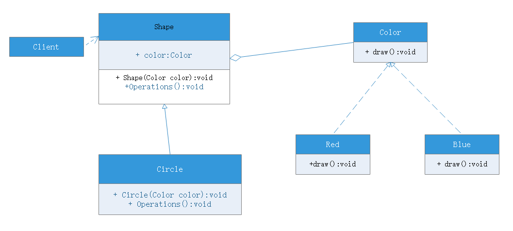

# 桥接模式(Bridge)

## 模式动机
设想如果需要绘制椭圆、正方形、圆形、矩形，我们至少需要4个类，但是如果要绘制的图形需要具有不同的颜色，如红、蓝、绿、黄，此时至少有如下俩个种方案：
1. 第一种设计方案是为每一种形状都提供一套各种颜色的版本
2. 第二种设计方案是根据实际需要对形状和颜色组合

对于有两种变化维度(即两个变化的原因)的系统，采用方案二来进行设计系统中类的个数更少，且系统拓展更为方便。设计方案二即是桥接模式的应用。桥接模式将**继承关系转换为关联关系**，从而降低了类间耦合程度，减少了代码量。

## 模式定义
桥接模式（Bridge）：**将抽象部分与它的实现分离，使它们都可以独立地变化**。是一种对象结构型模式，又称为接口模式。

## 模式结构
桥接模式包含如下角色：
- Abstraction：抽象类
- RefinedAbstraction：扩充抽象类
- Implementor：实现类接口
- ConcreteImplementor：具体实现类

## 模式分析
理解桥接模式，重点需要理解如何将抽象化(abstraction)与实现化(implementation)脱耦，使得二者可以独立变化。
- 抽象化就是忽略掉一些信息，把不同的实体当作相同的实体对待。在面向对象中，将对象的共同性质抽取出来形成类的过程称为抽象化
- 实现化针对抽象化给出的具体实现，就是实现化；实现化与抽象化是一对互逆的概念，实现化产生的对象是抽象化的具体实例，是对抽象化的事物的进一步具体化的产物
脱耦就是将抽象化和实现化二者进行分离，或者说将他们的强耦合改变为弱关联，将两个角色之间的继承关系改为关联关系。桥接模式中所谓的脱藕，就是指一个软件系统的抽象化和实现化之间使用关联关系（或者聚合关系、组合关系）而不是继承关系，从而使两者可以相对独立地变化，这就是桥接模式地用意，譬如说给形状上色，将形状颜色抽象，通过关联进行形状和颜色的练习。

## 实例
开发一个跨平台播放器，可以在不同的操作系统平台上播放多种格式的视频文件，常见的视频格式包括mpeg、rmvb、avi、wmv。

## 优点
桥接模式优点：
- 分离抽象接口及其实现
- 桥接模式提高了系统的可扩充性，在两个变化的维度中任意拓展一个维度，都不需要修改原有系统
- 实现细节对客户透明，可以对用户隐藏实现细节

## 缺点
桥接模式缺点：
- 桥接模式的引入会增加系统的理解难度与设计难度，由于聚合关联关系建立在抽象层，要求开发者针对抽象进行设计与编程。
- 桥接模式要求正确识别出系统中两个独立变化的维度，因此其使用范围具有一定局限性

## 适用环境
- 如果一个系统需要在构件的抽象化角色和具体角色之间增加更多的灵活性，避免在两个层次之间建立静态的继承联系，通过桥接模式可以使它们在抽象层建立一个关联关系
- 抽象化角色和实现化角色可以以继承的方式独立拓展而互不影响，在程序运行时可以动态将一个抽象化子类的对象和一个实现化子类的对象进行组合，**即系统需要对抽象化角色和实现化角色进行动态耦合**
- 一个类存在两个独立变化的维度，且两个维度都需要拓展
- 要求独立管理抽象化角色和具体化角色，并且两者需要独立变化

## 模式拓展
适配器模式与桥接模式的联用：

桥接模式和适配器模式可用于设计的不同阶段，桥接模式用于系统的开始阶段，对于存在两个独立变化维度的类可以将其抽象化和实现化分开，使它们可以分别变化；在初步设计完成后，当发现系统与已有类无法协同工作时，可采用适配器模式，但有时候设计初期也需要考虑适配器模式，特别是设计到大量的第三方应用接口的情况。