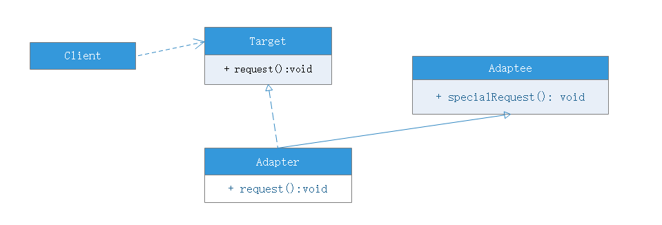

# 适配器模式

## 模式动机
- 在软件开发中采用类似于电源适配器的设计和编码技巧被称为适配器模式
- 通常情况下，客户端可以通过目标类的接口访问它所提供的服务。有时，现有的类可以满足客户类的功能需要，但它提供的接口不一定是客户类所期望的，这可能现有类于目标类的方法名不一致所导致的
- 在适配器模式中可以定义一个包装类，包装不兼容接口的对象，这个包装指的是适配器，它所包装的对象就是适配者，即被适配的类
- 适配器提供客户类需要的接口，适配器的实现就是把客户类的请求转化为对适配者的相应接口的调用；也就是说，当客户类调用适配器的接口时，在适配器类的内部将调用适配者类的方法，而这个过程对客户类来说是透明的，客户类并不直接访问适配者类。因此，适配器可以使由于接口不兼容而不能交互的类可以一起工作。这就是适配器的动机所在

## 模式定义
适配器模式(Adapter-pattern)：将一个接口转换成客户希望的另一个接口，适配器模式使接口不兼容的那些类可以一起工作，其别名包装器。适配器模式即可作为类结构模式(通过继承实现适配器模式)，也可作为对象结构模式(通过聚合形成适配器模式)。

## 模式结构
适配器模式包含如下角色:
- 目标抽象类：用于给客户类提供接口使用
- 适配器类：将适配者类的方法转换为继承自目标抽象类的方法
- 适配者类：需要进行适配器转换的类
- 客户类：需要使用适配者类的方法的类

对象适配器模式(基于对象的组装而不是继承)：

类适配器模式(基于继承或实现)：

## 模式优点
- 将目标（客户类需要使用的目标方法在其中）和适配者解耦，通过引入一个适配器类来重用现有适配者类，而无须修改原有代码
- 增加了类的透明性和复用性，将具体的实现封装在适配者类中，对于客户端来说时透明的，而且提高了适配者的复用性
- 灵活性和扩展性都非常好，通过使用配置文件，可以很方便地更换适配器，也可以在不修改原有代码地基础上增加新的适配器类，完全符合开闭原则

类适配器模式还具有如下优点：

由于适配器类是适配者子类，因此可以适配器类中置换一些适配者类地方法，使得适配器类更灵活。

对象适配器模式还具有如下优点：

一个对象适配器可以把多个不同地适配者适配到同一个目标，同一个适配器可以把适配器类和它地子类都适配到目标接口。

## 缺点
类适配器的缺点：

对于Java、C#等不支持多重继承的语言，一次只能适配一个适配者类，而且目标类只能为抽象接口，其使用有一定的局限性，不能将一个适配者类和它的子类都适配到目标接口。

对象适配器的缺点：

与类适配器模式相比，要想置换适配者类的方法不容易。如果想要更换适配者类的方法需要生成一个适配者类的子类，然后在其子类中覆盖适配者类方法，在适配器类中生成子类。

## 适用环境
- 系统需要使用现有类，而这些**类的接口不符合系统的需要**
- 想要建立一个可以重复使用的类，用于与一些彼此之间没有太大关联的一些类，包括一些可能在将来引进的类一起工作

## 模式应用
Sun公司在1996年公开了Java语言的数据库连接工具JDBC，JDBC使得Java语言程序能够与数据库连接，并使用SQL语言来查询、操作数据库。JDBC给出一个客户端通用的抽象接口，每一个具体数据库引擎的JDBC驱动软件都是一个介于JDBC接口和数据库引擎接口之间的适配器软件。抽象的JDBC接口和各个数据库引擎API之间都需要相应的适配器软件，这就是为各个不同数据库引擎准备的驱动程序。

## 模式扩展
缺省适配器模式：

当不需要全部实现接口提供的方法时，可先设计一个抽象类实现接口，并为该接口中的方法提供默认实现，那么该抽象类的子类可以有选择地扩展父类某些方法来实现需求，它适用于一个接口不想使用其所有方法。因此也称为单接口适配器。

## 总结
- 结构型模式描述如何将类或对象结合在一起形成更大的结构
- 适配器模式用于将一个接口转换为客户希望的另一个接口，适配器模式使接口不兼容的那些类可以一起工作，其别名包装器
- 适配器模式包含四个角色：目标抽象类定义客户要用的特定领域的接口，适配器类可以调用另一个接口，作为一个转换器，对适配者和抽象目标类进行适配，适配器模式的核心；适配者是作为被适配的角色，定义一个已经存在的接口，这个接口需要适配；在客户类中针对目标抽象类进行编程，调用在目标抽象类中定义的方法
- 适配器模式的主要优点是将目标类和适配者类解耦，增加了类的透明性和复用性，同时系统的灵活性和扩展性都非常好，更换适配器或者增加新的适配器都非常方便，符合开闭原则；类适配器的缺点是不能同时适配多个适配者，对象适配器的缺点是修改适配者类方法比较麻烦