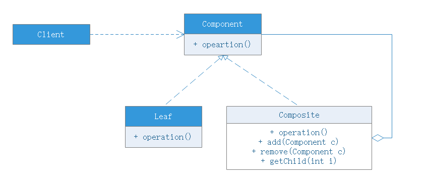

# 组合模式

## 模式动机
树形结构在软件中随处可见，例如操作系统中的目录结构、应用软件中的菜单、办公系统中的公司组织结构等等，**如何运用面向对象的方式来处理这种树形结构是组合模式需要解决的问题**，组合模式通过一种巧妙的设计方案使得用户可以一致性地处理整个树形结构或者树形结构的一部分，也可以一致性地处理树形结构中的叶子节点(不包括节点的子节点)和容器节点(包含子节点的节点)。
- 组合模式为处理树形结构提供了一种较为完美的解决方案，描述了如何将容器和叶子节点进行**递归组合**，使得用户在使用时无须对它们进行区分，可以一致地对待容器和叶子节点

## 模式定义
组合多个对象形成树形结构以表示具有“整体-部分”关系层次的结构。组合模式对单个对象(叶子节点)和组合对象(容器对象)的使用具有统一性，组合模式又可以称为“整体-部分”模式，是一种对象结构模式。

## 模式结构
模式角色：
- Component
    - 可以是接口或者抽象类，为叶子构件和容器构件对象生命接口，在该角色中可以包含所有子类共有行为的生命和实现。在抽象构件中定义了访问及管理它的子构件的方法，如增加构件、删除构件、获取子构件
- Leaf
    - 在组合模式表示叶子节点的对象，叶子节点没有子节点，实现了抽象构件中定义的行为，对于那些访问及管理子构件的方法，可以通过异常进行处理
- Composite
    - 表示容器对象，包含子节点，其子节点可以是叶子节点，也可以是容器节点，提供了一个集合用于存储子节点，实现了在抽象构件中定义的行为，包括访问及管理子构件的行为，在其业务方法中可以递归调用其子节点的业务方法

## 模式扩展
- 透明组合模式
    - 抽象构件Component声明了所有用于管理成员对象的方法，包括add()、remove()、getChild()，这样做的好处是确保所有的构件类都有相同的接口。在客户端看来，叶子对象与容器对象所提供的方法是一致的，客户端可以相同的对待所有对象。透明组合模式也是组合模式的标准形式。
    - 透明组合模式缺点是不够安全，因为叶子对象和容器对象本质上还是有区别，叶子对象不可能有下一个层次对象，即不可能包含成员对象，因此为其提供add()等方法是没有意义的，这在编译阶段不会出错，但在运行期间可能会出错
- 安全组合模式
    - 在抽象构件中没有声明任何用于管理成员对象的方法，而是在Composite类中声明这些方法。
    - 缺点是不够透明，因为叶子构件和容器构件具有不同的方法，且容器构件中那些用于管理成员对象的方法没有在抽象构件类中定义，因此客户端也不能完全针对抽象编程（不满足依赖倒置原则），必须有区别地对待叶子构件和容器构件

## 优点
- 组合模式可以清除定义分层次地复杂对象，表示对象地全部或部分层次，他**让客户端忽略层次地差异**，方便地对整个层次结构进行控制
- 客户端可以一致地使用一个节点或容器，不必关心处理地是单个对象还是组合结构，简化了客户端代码
- 在组合模式中新增叶子或者容器都很方便，只需要新增对应的类即可，复合开闭原则
- 组合模式为树形结构地面向对象实现提供了一种灵活地解决方案，通过叶子对象和容器对象地递归组合，可以形成复杂的树形结构，但对树形结构的控制却很简单

## 缺点
- 新增构件时很难对容器中的构件类型进行限制

## 适用场景
- 具有整体和部分的层次结构中，希望通过一种方式忽略掉整体和部分的差异，客户端可以一致的对待它们
- 在一个面向对象语言开发的系统中需要使用一个树形系统
- 在一个系统中需要分离出叶子对象和容器对象，而且它们类型不固定，需要增加一些新的类型