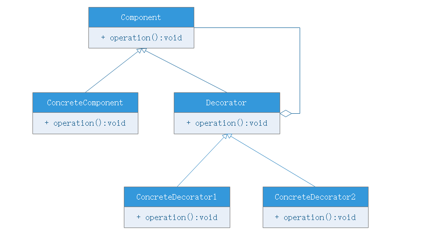

# 装饰模式

## 模式动机
一般有两种方式可以实现**给一个类或对象增加行为**：
- 继承，使用继承机制给现有类添加功能的一种有效途径，通过继承一个现有类可以使得子类在拥有自身方法的同时还拥有父类的方法。但是**这种方法是静态的**，**用户不能控制增加行为的方式和时机**
- 关联机制，将一个类的对象嵌入另一个对象中，由另一个对象来决定是否调用嵌入对象的行为以便扩展自己的行为，我们称这个嵌入的对象为装饰器

装饰模式以对客户端透明的方式动态地给一个对象附加上更多的职责，换言之，客户端并不会觉得对象在装饰前后装饰后有什么不同。装饰模式可以在不需要创建更多子类的情况下，将对象的功能加以拓展，这就是装饰模式的动机。

## 模式定义
装饰模式（Decorator Pattern）：动态的给一个对象增加一些额外额外的职责，就增加对象功能来说，装饰模式比生成子类更灵活。其别名也可以称为包装器，与适配器的别名相同，但它们适用于不同的场景。

## 模式结构
装饰模式包含如下角色：
- Component：抽象构件
- ConcreteComponent：具体构件
- Decorator：抽象装饰类
- ConcreteDecorator：具体装饰类

## 模式分析
- 与继承关系相比，关联关系的主要优势在于不会破坏类的封装性，而且继承是一种耦合度较大的静态关系，无法在程序运行时动态扩展。在软件开发阶段，关联关系虽然不会比继承关系减少代码量，但是到了维护阶段，由于关联关系是系统具有较好的松耦合，因此使得系统更加容易维护。当然，关联关系的缺点是比继承要创建更多的对象
- 使用装饰模式来实现拓展比继承更灵活，它以对客户端透明的方式动态地给一个对象附加更多地责任。装饰模式可以在不需要创建更多子类的情况下将对象的功能加以拓展
- 抽象装饰类需要持有抽象构件类的引用，从而对具体装饰类生成的具体构架类进行装饰

## 优点
- 装饰模式与继承关系的目的都是拓展对象的功能，但是装饰模式可以提供比继承更多的灵活性
- 可以通过一种动态的方式来扩展一个对象的功能，通过配置文件可以在运行时选择不同的装饰器，从而实现不同的行为
- 通过使用不同的具体装饰类以及这些装饰类的排列组合，可以创造出很多不同行为的组合。可以使用多个具体装饰类来装饰同一个对象，得到功能更为强大的对象
- 具体构件类与具体装饰类可以独立变化，即具体构件与具体装饰两者都是具有独立变化维度的类，用户可以根据需要新增具体构建类和具体装饰类，在使用时对其进行组合，源代码无须改变，符合”开闭原则“

## 缺点
- 使用装饰模式进行开发时会产生很多小对象，这些小对象的区别在于它们之间相互连接的方式有所不同，而不是它们的类或属性值有所不同，同时还会产生很多具体装饰类。这些装饰类和小对象的产生将会增加系统复杂度，加大学习和理解的难度
- 这种比继承更加灵活的特性，同时意味着装饰模式比继承更加容易出错，排错也很困难，对于多次装饰的对象调试时需要逐级排查比较繁琐

## 适用环境
- 在不影响其他对象的情况下，以动态、透明的方式给单个对象添加职责
- 需要动态地给一个对象增加功能，这些功能也可以被撤销
- 当不能采用继承地方式对系统进行扩展或者采用继承不利于系统扩展和维护时。不能采用继承地情况主要有两种：
1. 系统中需要扩展的类太多以至于直接进行继承会带来大量的冗余代码
2. 类被定义成final不允许继承

## 模式扩展
装饰模式的简化-需要注意的问题：
- 一个装饰类的接口必须与被装饰类的接口保持相同，对于客户端来说无论是装饰之前的对象或者是装饰之后的对象都可以一直对待
- 尽量保持具体构件类Component作为一个“轻”类，也就是说不要把太多的逻辑和状态放在具体构件类，可以通过装饰类对其进行扩展。
- 如果一个具体构件类没有抽象构件类，那么抽象装饰类可以直接作为具体构件类的子类
