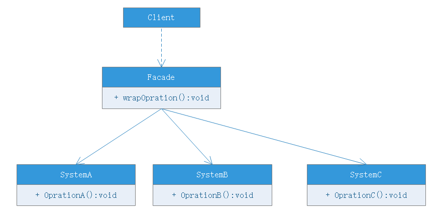

# 外观模式

## 模式定义
外观模式（Facade Pattern）：外部与一个子系统的通信必须通过一个统一的外观对象进行，为子系统中的一组接口提供一个一致的界面，外观模式定义了一个高层接口，这个接口使得这一子系统更容易使用。外观模式又称为门面模式，属于对象结构型模式。

## 模式结构
外观模式包含如下角色：
- Facade：外观角色
- SubSystem：子系统

## 模式分析
根据单一职责原则，在软件中将一个系统分为多个子系统有利于降低整个系统的复杂性，一个常见的设计目标是使**子系统间的通信和相互依赖关系**达到最小，而达到该目的的途径就是引入一个外观对象，它为子系统提供了一个简单而单一的入口。
- 外观模式也是“迪米特法则”的体现，通过引入一个外观类可以降低原有系统的复杂度，同时降低客户类与子系统类的耦合度
- 外观模式要求一个子系统的外部与其内部的通信通过一个统一的外观对象进行，外观类将客户类与子系统的内部复杂性分隔开，使得客户类只需要与外观类进行交互而不需要与子系统的很多对象打交道
- 外观模式的目的在于降低系统的复杂度
- 外观模式很大程度提高了客户类的便捷性使得客户端无须关心子系统的工作细节，通过外观角色即可调用相关功能

## 优点
- 对客户屏蔽了子系统实现细节，减少客户处理的子系统对象个数并使子系统使用起来更加容易。通过引入外观模式，客户代码变得简单，与之关联的对象也很少
- 实现了子系统与客户类的松耦合关系，这使得子系统的组件变化不会影响调用它的客户类，只需要调整外观类即可
- 降低了大型软件系统中的编译依赖性，简化系统在不同平台的移植过程，因为编译一个子系统并不需要编译其他所有的子系统。一个子系统的修改对其他子系统没有任何影响，而且子系统内部变化也不会影响到外观对象
- 只是提供一个访问子系统的接口，并不会影响用户直接使用子系统

## 缺点
- 不能很好的限制客户使用子系统类，如果对客户访问子系统做太多的限制则减少了可变性和灵活性
- 在不引入抽象外观的情况下，增加新的子系统需要修改原有外观类或者客户类代码，违背了“开闭原则”

## 适用环境
- 当要为一个复杂子系统提供一个简单接口时可以使用外观模式。该接口可以满足大多数用户的需求，而且用户也可以越过外观类直接操作子系统
- 客户程序与子系统存在很大的依赖性，引入外观类将子系统与客户以及其他子系统解耦，可以提高子系统的独立性和可移植性
- 在层次化结构中，可以使用外观模式定义系统中每一层的入口，层与层之间不直接联系，而是通过外观类建立联系，降低层间耦合

## 模式拓展
- 一个系统有多个外观类
    - 在外观模式中，通常只需要一个外观类，并且此外观类只有一个实例，换言之它是一个单例类。在很多情况下为了节约系统资源，一般将外观类设计为单例类。当然并不意味着整个系统只有一个外观类，在一个系统可以设计多个外观类，每个外观类都负责与特定子系统打交道，向用户提供相应的业务功能
- 不要试图通过外观类为子系统增加新的行为
    - 不要通过继承外观类在子系统中加入新的行为，这种做法是错误的。外观模式的用意是为子系统提供一个集中化和简化的沟通渠道，而不是向子系统添加新的行为，新的行为应该通过修改原有子系统或者新增新的子系统实现而不是通过外观类来实现
- 外观模式与迪米特法则
    - 外观模式创建出一个外观对象，将客户端所涉及的属于一个子系统的协作伙伴数量减到最少，使得客户类与子系统内部的对象的相互作用被外观对象取代。外观类充当了客户类与子系统之间的“第三者”，降低了客户类与子系统之间的耦合度，外观模式就是实现代码重构以便达到“迪米特法则”要求的一个强有力武器
- 抽象外观类的引入
    - 外观模式的最大缺点就是违背了开闭原则，当增加新的子系统或移除子系统时需要修改外观类，可以通过引入抽象外观类在一定程度上解决该问题，客户类针对抽象外观类进行编程。对于新业务需求，不需要修改原有外观类，而是新增具体外观类，由新的具体外观类来关联新的子系统对象，同时修改配置文件来达到不修改源代码并更换外观类的目的