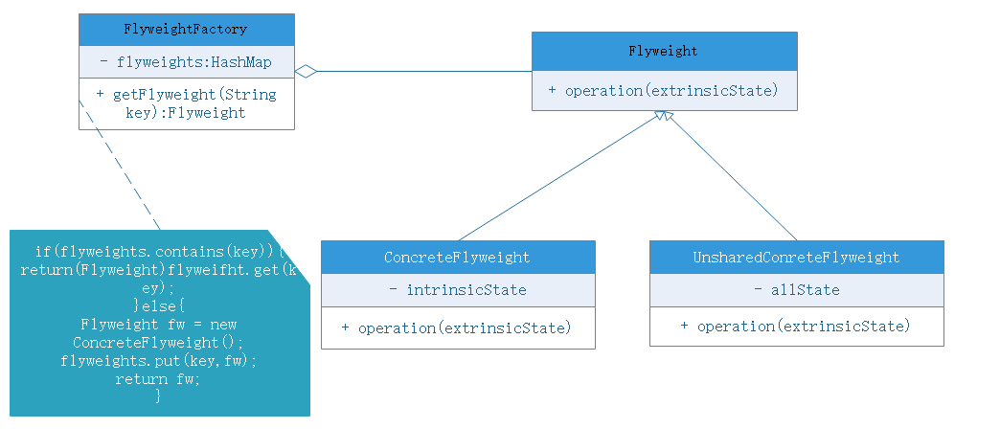

# 享元模式

## 模式动机
面向对象技术可以很好的解决一些灵活性或可扩展性，但很多情况下需要增加系统中类和对象的个数。将数量太多会导致运行代价过高，带来性能方面的下降。
- 享元模式正式为了解决这一问题而产生的，通过共享技术实现相同或相似对象的重用
- 在享元模式中可以共享的相同内容称为内部状态，而那些需要外部环境来设置不能共享的内容称为外部状态，由于区分了内部状态和外部状态，因此可以通过设置不同的外部状态使得相同的对象可以具有一些不同的特征，而相同的内部状态是可以共享的
- 在享元模式中会出现工厂模式，需要创建一个享元工厂来负责维护一个享元池用于存储具有相同内部状态的享元对象
- 在享元模式中共享的是享元对象的内部状态，外部状态需要通过环境设置。在实际应用中，能够共享的状态是有限的，因此享元对象一般都设计成较小的对象，它所包含的内部状态较少，这种对象也叫做细粒度对象。享元模式的目的就是使用共享技术来实现大量细粒度对象的复用

## 模式定义
享元模式（Flyweight）：运用共享技术有效地支持大量细粒度对象的复用。系统只使用少量的对象，而这些对象都很相似，状态变化很小，可以实现对象的多次复用。由于享元模式要求能够复用的对象都是细粒度对象，因此又被称为轻量级模式，它是一种对象结构型模式。

## 模式结构
享元模式包含如下角色：
- Flyweight：抽象享元类
- ConcreteFlyweight：具体享元类
- UnsharedConcreteFlyweight：非共享享元类
    - 并不是所有的抽象享元类的子类都需要共享，不能被共享的子类可设计为非共享具体享元类；当需要一个非共享具体享元类的对象时可以直接通过实例化创建
- FlyweightFactory：享元工厂

## 模式分析
享元模式是一个考虑系统性能的设计模式，通过使用享元模式可以节约空间，提高系统的性能。

享元模式的核心在于享元工厂类，享元工厂类的作用在于提供一个存储享元对象的享元池，用户需要对象时，首先从享元池中获取，如果享元池中不存在，则创建一个新的享元对象返回给用户，并在享元池中保存该对象。

享元模式以共享的方式高效地支持大量的细粒度对象，享元对象能做到共享的关键是区分内部状态和外部状态。
- 内部状态是存储在享元对象内部并且不会随环境变化而改变的状态，因此内部状态可以共享
- 外部状态是随环境改变而改变、不可以共享的状态。享元对象的外部状态必须由客户端保存，并在享元对象被创建后，在需要使用的时候再传入享元对象。一个外部状态与另一个外部状态之间是相互独立的

## 优点
- 享元模式的优点在于它可以极大减少内存中对象的数量，使得相同对象或相似对象在内存中只保存一份
- 享元模式外部状态相对独立，而且不会影响内部状态，使得享元对象可以在不同环境中共享

## 缺点
- 享元模式使得系统更加复杂，需要分离出内部状态、外部状态，使得程序逻辑复杂化
- 为了使对象可以共享，享元模式需要将享元对象的状态外部化，而读取外部状态使得运行时间变长

## 应用
享元模式在编辑器软件大量使用，如在一个文档中出现多次相同图片，则只需要创建一个对象，通过在应用程序设置该图片出现的位置，可以实现该图片在不同地方多次复用

## 扩展
单纯享元模式和复合享元模式：
- 单纯享元模式：所有享元对象都是可共享的，不存在非共享享元对象
- 复合享元模式：将一些单纯享元使用组合模式加以组合，可以形成复合享元对象，这些复合享元对象本身不能共享，但是分解为单纯享元对象，后者可以共享

享元模式与其他模式的使用：
- 在享元模式的享元工厂类中通常提供一个静态的工厂方法用于返回享元对象，使用简单工厂模式来生成享元对象，并且使用单例模式让工厂模式只能有一个实例保证享元对象的数量
- 在一个系统中，通常只有一个享元工厂，因此享元工厂类使用单例模式进行设计
- 享元模式可以结合组合模式形成复合享元模式，统一对享元对象设置外部状态