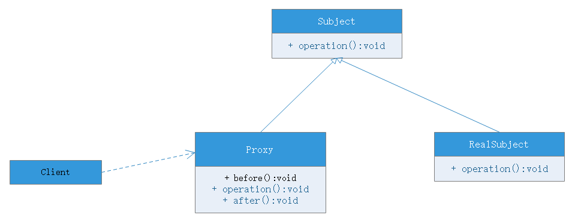

# 代理模式

## 模式动机
某些情况下，一个客户不想或者不能直接引用一个对象，此时可以通过一个称为”代理“的第三者来间接使用。代理对象可以在客户端和目标之间起到中介的作用，并且可以通过代理对象去掉客户不能看到的内容和服务或者添加客户需要的服务。

通过引入一个新对象来实现对真实对象的操作或者将新的对象作为真实对象的一个替身，这种实现机制即为代理模式，通过引入代理对象来间接访问一个对象，这就是代理模式的动机。

## 模式定义
代理模式（Proxy Pattern）：给某一个对象提供一个代理，并由代理对象控制原对象的引用。代理模式使一种对象结构型模式。

## 模式结构
- Subject：抽象主体角色
- RealSubject：真实主体角色
- Proxy：代理主体角色

## 优点
- 代理模式能够协调调用者和被调用者，在一定程度上降低了系统耦合度
- 远程代理使得客户端可以访问远程机器上的对象，远程机器可能具有更好的计算性能和处理速度，可以快速响应并处理客户端请求
- 虚拟代理通过使用一个小对象代表一个大对象，可以减少系统资源的消耗，对系统进行优化并提高运行速度
- 保护代理可以控制对真实对象的使用权限

## 缺点
- 由于在客户端和真实主体增加了代理对象，因此有些类型的代理模式可能会造成请求的处理变慢
- 实现代理模式需要额外工作，有些代理模式的实现非常复杂

## 适用环境
- 远程代理
    - 为一个位于不同的地址空间的对象提供一个本地的代理对象，这个不同的地址可以是一台主机或者是另一台主机
- 虚拟代理
    - 如果需要创建一个资源消耗较大的对象，先创建一个消耗较小的对象来表示，真实对象只在需要时才会被创建
- Copy-on-Write
    - 虚拟代理的一种，把复制操作延迟到只有在客户端真正需要的时候才执行。一般来说，对象的深克隆是一个开销较大的操作，Copy-on-Write代理可以让这个操作延迟，只有对象被用到的时候才克隆
- 保护代理
    - 控制对一个对象的访问，可以给不同的用户提供不同级别的适用权限
- 缓冲代理
    - 为一个目标操作的结果提供临时存储空间，以便多个客户端可以共享这些结构
- 防火墙代理
    - 保护目标不让恶意用户接近
- 同步化代理
    - 使几个用户能够同时使用一个对象而没有冲突
- 智能引用代理
    - 当一个对象被引用时，提供一些额外的操作，如将此对象被调用的次数记录下来等

## 模式应用
EJB、Web Service等分布式技术都是代理模式的应用。在EJB中使用了RMI机制，远程服务器中的企业级Bean在本地有一个桩代理，客户端通过桩代理来使用远程对象中定义的方法，而无须直接与远程对象交互。在EJB的使用中需要提供一个公共的接口，客户端针对接口编程，无须知道桩以及远程EJB实现细节

## 模式扩展
几种常见的代理模式
- 图片代理
    - 一个很常见的代理模式的应用就是对大图浏览的控制，用户通过浏览器访问网页时先不加载图片大图，而是通过代理对象的方法进行处理，在代理对象的方法中，先使用一个线程向客户端浏览器加载一个小图片，然后在后台使用另一个线程来调用大图片的加载方法将大图片加载到客户端。通过代理技术结合多线程编程将真实图片的加载放到后台操作，不影响前端图片浏览
- 远程代理
    - 远程代理可以将网络的细节隐藏起来，使得客户端不必考虑网络的存在，客户完全可以认为被代理的远程业务时局域的而不是远程的，远程代理对象承担了大部分网络通信工作
- 虚拟代理
    - 当一个对象的加载十分耗时,虚拟代理的作用就体现出来了。虚拟代理实现为一个小对象，先加载这个小对象，当需要实际用到大对象时大对象才被创建。在应用程序启动时，可以用代理对象代替真实对象初始化，节省了内存使用，并大大加速了系统启动时间
- 动态代理
    - 传统的代理模式中，真实主体角色是预先存在的，并将其作为代理对象的内部成员。如果一个真实主体角色必须对应一个代理主体角色，将导致系统的类个数急剧增加，因此需要想办法减少系统中类的个数。此外，如何在事先不知道真实主题角色的情况下使用代理主题角色，这都是动态代理需要解决的问题